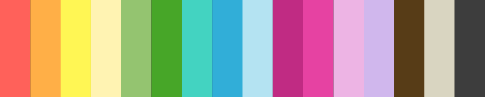

# AnotherKolor

AnotherKolor is a custom theme for the Vim editor ported from the original [AnotherKolor for Sublime Text](https://github.com/danyadsmith/AnotherKolor) and [AnotherKolor for VS Code](https://marketplace.visualstudio.com/items?itemName=danyadsmith.anotherkolor). The theme uses the following colors:

This theme currently supports the following languages:

* C#
* JavaScript
* Ruby
* CSS
* HTML
* XML

`C#` support is extended through the use of syntax customizations and the
`TagHighlights` plugin. To achieve the most complete color highlighting for the
C# language, the following customizations are required:

* [Exuberant Ctags](http://ctags.sourceforge.net/) or [Universal Ctags](https://ctags.io/)
* [TagHighlight](https://github.com/vim-scripts/TagHighlight)
* The [vim-csharp](https://github.com/OrangeT/vim-csharp) plugin

Full `JavaScript` support requires the following plugin:

* [vim-javascript](https://github.com/pangloss/vim-javascript)

This theme is currently under development. Contributions are welcome.
