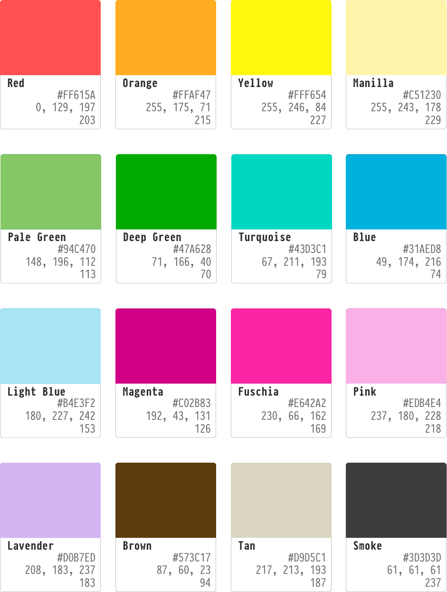

# AnotherKolor Color References

This color swatch image provides color codes in HEX, rgb and 256 color.

For a table of copy/paste-able values, the following table is provided:

| Color Name | HEX     | RGB                | HSL                |
|------------|---------|--------------------|--------------------|
| RED        | #FF615A | rgb(255, 97, 90)   | hsl(3, 100%, 68%)  |
| ORANGE     | #FFAF47 | rgb(255, 175, 71)  | hsl(34, 100%, 64%) |
| YELLOW     | #FFF654 | rgb(255, 246, 84)  | hsl(57, 100%, 66%) |
| MANILLA    | #FFF3B2 | rgb(255, 243, 178) | hsl(51, 100%, 85%) |
| PALE GREEN | #94C470 | rgb(148, 196, 112) | hsl(94, 42%, 60%)  |
| DEEP GREEN | #47A628 | rgb(71, 166, 40)   | hsl(105, 61%, 40%) |
| TURQUOISE  | #43D3C1 | rgb(67, 211, 193)  | hsl(173, 62%, 55%) |
| BLUE       | #31AED8 | rgb(49, 174, 216)  | hsl(195, 68%, 52%) |
| LIGHT BLUE | #B4E3F2 | rgb(180, 227, 242) | hsl(195, 70%, 83%) |
| MAGENTA    | #C02B83 | rgb(192, 43, 131)  | hsl(325, 63%, 46%) |
| FUSCHIA    | #E642A2 | rgb(230, 66, 162)  | hsl(325, 77%, 58%) |
| PINK       | #EDB4E4 | rgb(237, 180, 228) | hsl(309, 61%, 82%) |
| LAVENDER   | #D0B7ED | rgb(208, 183, 237) | hsl(268, 60%, 82%) |
| BROWN      | #573C17 | rgb(87, 60, 23)    | hsl(35, 58%, 22%)  |
| TAN        | #D9D5C1 | rgb(217, 213, 193) | hsl(50, 24%, 80%)  |
| SMOKE      | #3D3D3D | rgb(61, 61, 61)    | hsl(0, 0%, 24%)    |
